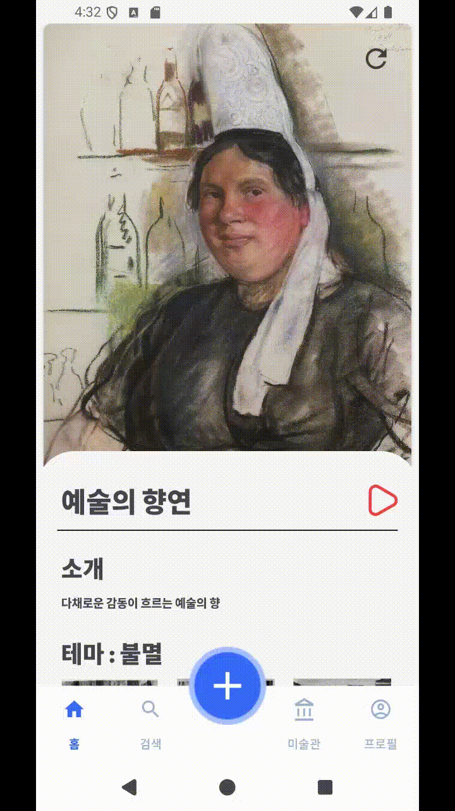

#  🎨 Arti - 추천을 통한 나만의 미술관 🎨

 
Arti 서버 링크: https://j11d106.p.ssafy.io/ 

Arti 앱 다운로드 링크: https://drive.google.com/file/d/1q8peKZ60zqSLBoF9xtDdnVBwqG_QEvJO/view?usp=drive_link

   

## 서비스 개요
'Arti'는 사용자들이 나만의 미술관을 즐기고, 그 안에서 다양한 작품과 음악을 경험할 수 있는 앱입니다.

사용자는 미술관을 구독하거나 자신만의 포트폴리오를 관리하며, AI 작품과 실시간으로 생성된 음악을 통해 몰입감을 느낄 수 있습니다.

또한, 검색을 통해 작품 추천을 받을 수 있습니다.

  

## 주요 기능

- 회원가입 및 콜드스타트 해결
  - 사용자가 처음 앱을 사용하면, 추천을 위한 데이터를 확보하기 위해 사용자의 인스타그램에 있는 이미지를 가져오는 등 사용자의 정보를 수집하고 맞춤형 작품을 제공합니다. 이를 통해 콜드스타트 문제를 해결하고, 빠르게 사용자가 흥미를 느낄 수 있도록 지원합니다.

- 미술관 페이지(음악 생성, AR)
  - 사용자가 소유한 미술관 페이지에서는 실시간으로 생성된 음악을 배경으로 감상할 수 있으며, 증강현실(AR)을 통해 작품을 더욱 생생하게 경험할 수 있습니다.

- 검색 및 추천 기능
  - 추천 시스템을 통해 사용자의 최근 관심사에 맞는 작품을 추천받을 수 있습니다.
  - 사용자는 검색 페이지에서 화가, 장르, 미술관을 랜덤으로 추천받을 수 있습니다.

- 구독한 미술관 저장
  - 사용자는 자신이 관심 있는 미술관을 구독하고 저장할 수 있습니다.

- 포트폴리오 관리
  - 포트폴리오 기능을 통해 사용자는 자신이 좋아하는 장르의 비율을 분석하고, 관심 있는 화가를 조회할 수 있습니다. 이를 통해 사용자들은 자신의 취향을 더 명확히 알 수 있습니다.

  

## 프로젝트 정보
- 프로젝트명 :  
  SSAFY 11기 2학기 특화 프로젝트 - Arti

- 기간 :  
  2024/08/18 ~ 2024/10/11

- 팀원 :  
  육각형 6조(D106)의 팀원들을 소개합니다!

  | 이름   | 역할          | 개발 내용                   |
    | ------ | ------------- | --------------------------- |
  | 황병현 | 팀장 Data | - EfficientNetV2를 활용한 미술관 및 미술품 추천 - Fast-Style-Transfer를 활용한 content이미지에 style이미지 합성 - BILP, MusicGen을 활용한 image2music생성 - 데이터 전처리 |
  | 김헌우 | Backend       | - 미술품, 미술관 관련 기능 구현 - 구독, 화가, 테마 관련 기능 구현 - 검색 및 랜덤 조회 로직 구현 - 세부 예외처리 로직 구현 및 캐싱, 쿼리 최적화를 통한 조회 속도 최적화 |
  | 김주현 | Backend       | - 회원가입을 위한 이메일 인증 구현 - 프로젝트 문서화 |
  | 박민희 | Backend       | - ELK Stack 활용하여 이미지 조회수 기간별로 집계 및 그에 따른 이미지 저장 위치 분리 로직 구현 - JWT 인증 구현 - 인스타그램 API 연동 - CI/CD |
  | 김민조 | Android       | - 이미지 다운샘플링을 통한 통신 속도 최적화   - ARSceneview 를 활용한 AR 구현  - PieChart 구현  - 추천 데이터 표시 |
  | 문동진 | Android       | - 회원 관리 구현 - 미술관 UI 구현 - dataStore를 통한 데이터 관리 - 음악 및 파일처리 |

  

## 주요 기술 및 개발 환경

### 아키텍처 구성도

### **Android**

- **Build Tools:**
  - Gradle
  - Hilt
  - Kotlin KAPT
- **Libraries:**
  - Core KTX
  - AppCompat
  - Material Components
  - ConstraintLayout
- **Dependency Injection:**
  - Hilt
- **Networking:**
  - Retrofit
  - OkHttp Logging Interceptor
- **Coroutines:**
  - Kotlin Coroutines Core
  - Kotlin Coroutines Android
- **ViewModel:**
  - AndroidX Lifecycle ViewModel KTX
- **Navigation:**
  - AndroidX Navigation Fragment KTX
  - AndroidX Navigation UI KTX
- **Logging:**
  - Timber
- **AR (Augmented Reality):**
  - ARSceneView

### Backend

- **Java 17**

- **Spring Boot**

  - Spring Data JPA

  - Spring Data Redis

  - Spring Mail

  - Spring Security

  - Spring Validation

  - Spring Web

- **AWS S3**

- **JWT (JSON Web Token)**

- **QueryDSL**

- **OpenCSV**

- **Logstash**

- **Lombok**

- **H2 Database**

- **MySQL**

- **사용한 외부 API**

  - Google HTTP Client

  - SpringDoc OpenAPI

### **AI**

- **Deep Learning Frameworks:**
  - TensorFlow
  - PyTorch
- **NLP (Natural Language Processing):**
  - HuggingFace Transformers
  - Tokenizers
- **Machine Learning Utilities:**
    - Faiss
    - Opt-einsum
- **Data Processing:**
  - Pandas
  - Numpy
  - Scipy
- **GPU Support:**
  - CUDA
- **Model Deployment:**
    - Uvicorn for ASGI server
    - FastAPI for API development

### CI/CD

- AWS EC2
- Docker
- Jenkins

  

## 협업 툴

- GitLab - 코드 버전 관리 및 MR과 리뷰
- Jira - 매주 목표량 설정, 프로젝트 진행도 확인
- Notion - 회의록 작성, 기술 레퍼런스 공유, 프로젝트 산출물 관리
- Figma - 목업, 와이어프레임, 디자인 공유
- MatterMost - 자료 및 api 현황과 요청사항 공유

  

## 포팅 메뉴얼

포팅 메뉴얼 링크: [포팅 메뉴얼](./exec/README.md)

  

## 프로젝트 산출물

### UI 디자인

  

### ERD

  

## UCC 및 시연영상

- UCC 링크: https://youtu.be/EFBWKJcovHE

    

## 주요 서비스 화면

### 1. 홈
- 접속한 유저를 위한 미술관을 추천

   

### 2. 검색
- 미술품 추천

  
   

- 화가 랜덤 검색

  
     

- 장르 랜덤 검색

  
     

- 미술관 랜덤 검색

  
     

### 3. AI 이미지 생성
- 기존의 유명한 작품의 화풍을 유저가 제공하는 이미지에 적용

  
     

### 4. 미술관
- 구독한 미술관과 내 미술관을 조회

  
   

### 5. 미술관 상세 페이지
- 해당 미술관에 어울리는 배경음악을 AI가 생성후, 실제 미술관에 방문한 것처럼 미술 작품들을 감상 가능.

  
     

- AR 기능으로, 실제 유저가 있는 공간에 작품을 전시할 수 있음.
  
  
     

### 6. 포트폴리오
- 유저의 예술 성향을 파악할 수 있음.

  
   
